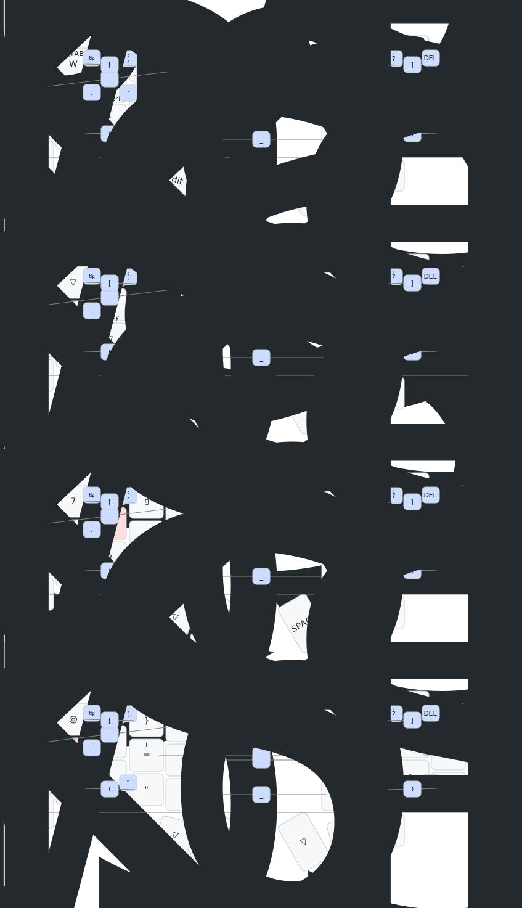

# dance!
my config for [dance!](https://github.com/chase-hunter/dance)

# Features
- Mouse keys
- Dongle ([prospector](https://github.com/carrefinho/prospector-zmk-module) 

## keymap

lambda time?
